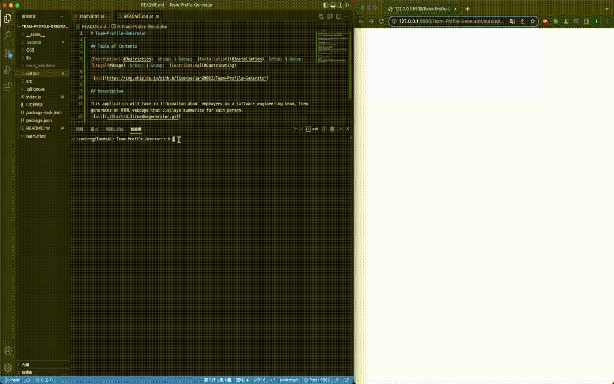

# Team-Profile-Generator
    
[Description](#Description)  &nbsp; | &nbsp;  [Installation](#Installation)  &nbsp; | &nbsp;  [Usage](#Usage)  &nbsp; | &nbsp;  [Contributing](#Contributing)  
          

  
## Description
          
This application will take in information about employees on a software engineering team, then generates an HTML webpage that displays summaries for each person.  


## Installation
      
1. Download the Team-Profile-Generator.
2. Open with VScode.
3. Right the Start file and choose open with the terminal.
          
## Usage
      
1. Enter the ```node index``` in the terminal.
2. Enter the detail of the each team member.
3. Done! It will be generated for you.

if you have question please review the [video of usage](https://watch.screencastify.com/v/ZVfVjGH20gcjy3bbC281)
          
## Contributing
          
[ian29012](https://github.com/ian29012)
          
          
## license
  
The MIT License covers this application
          
## Questions
    
Thank you for taking the time to review my project. 
Please feel free to reach my other project on [ian29012](https://github.com/ian29012)  
If you have any problem please do not hesitate to contact me with [iancheng29012@gmail.com](iancheng29012@gmail.com).